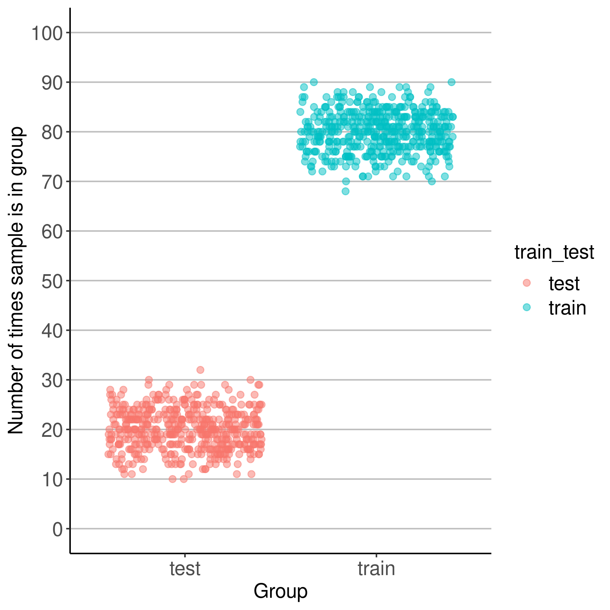

```{r setup, include=FALSE}
knitr::opts_chunk$set(echo = FALSE,message=FALSE)

library(tidyverse)
library(kableExtra)
#library(caret)
#library(pROC)
```
### Table of Contents

-   [Project Summary](#summary)
-   [Overview of data splits](#splits)

### Project Summary {#summary}
...explanation of project....

### Overview of data splits {#splits}

Since the random 80% training 20% testing splits are generated 100 times, we anticipate that if the samples are randomly assigned each one should appear in the training set about 80 of the 100 times (80%) and testing about 20 of the 100 times (20%). The plot below visualizes how many times each sample appears in the training and testing datasets.

```{r plot_splits}

```
### Percent of reads mapped with OptiFit

...in progress...

### Model performance during training

```{r cv_auc}

optifit_cv_files <- list.files(path="../data/learning/results/optifit/",
                               pattern="cv_results_split_.*.csv",
                               full.path=TRUE)
                         


```

### ...THE REST IS MISC LEFTOVER FROM PREVIOUS ANALYSIS...

### Percent of reads mapped with OptiFit

```{r reads_mapped}

# fraction_mapped <- read_tsv("../results/tables/fraction_reads_mapped.tsv")

# med <- median(fraction_mapped$fraction_mapped)
# med_frac <- paste0(100*median(fraction_mapped$fraction_mapped),"%")
# min_frac <- paste0(100*min(fraction_mapped$fraction_mapped),"%")
# max_frac <- paste0(100*max(fraction_mapped$fraction_mapped),"%")

# fraction_mapped %>% 
#   ggplot(aes(x=fraction_mapped)) + 
#     geom_histogram(fill="grey",color="black") +
#   theme_bw() + 
#   scale_x_continuous(labels=scales::percent) +
#   xlab("Percent of reads mapped with cluster.fit") +
#   ylab("number of samples") +
#   geom_vline(xintercept = med,lty="dashed",lwd=1) +
#   annotate("text", x=.90, y=55, label= paste0("Median: ",med_frac)) +   
#   annotate("text", x=.90, y=50, label= paste0("Max: ",max_frac)) +
#   annotate("text", x=.90, y=45, label= paste0("Min: ",min_frac))   


```

### MCC OptiFit vs OptiClust

```{r mcc}

# sensspec <- read_csv("../results/tables/merged_sensspec.csv")

# mcc_data <- sensspec %>% 
#   select(type,sample,mcc) %>% 
#   mutate(type=factor(type,levels=c("opticlust","optifit_out","optifit_in"),labels=c("OptiClust_all","OptiClust_489","OptiFit_1")))

# #mcc_data$type <- factor(mcc_data$type,levels=c("OptiClust_all","OptiClust_489","OptiFit_1"))
# mcc_data %>% 
#   ggplot(aes(x=type,y=mcc,color=type)) + 
#     geom_jitter(height=0,size=3,alpha=0.6) +
#     xlab("") +
#     theme_bw() +
#     stat_summary(fun=median,geom="crossbar",color="black",lwd=0.3)

```


### Model performance during training
```{r data}

# optifit_summary <- read_tsv("../data/learning/summary/optifit/model_results.tsv",
#                             col_types = cols(sample = col_character(),
#                                              cv_auc = col_double(),
#                                              cancer = col_double(),
#                                              normal = col_double(),
#                                              dx_diff = col_double(),
#                                              dx_flag = col_factor(),
#                                              pred_class = col_number(),
#                                              meta_class = col_number()
#                                              ))  %>% 
#   mutate(pred_class = case_when(pred_class == 0 ~ "normal",
#                                 TRUE ~ "cancer")) %>% 
#   mutate(meta_class = case_when(meta_class == 0 ~ "normal",
#                                 TRUE ~ "cancer"))

# opticlust_summary <- read_tsv("../data/learning/summary/opticlust/model_results.tsv",
#                               col_types = cols(sample = col_character(),
#                                                cv_auc = col_double(),
#                                                cancer = col_double(),
#                                                normal = col_double(),
#                                                dx_diff = col_double(),
#                                                dx_flag = col_factor(),
#                                                pred_class = col_factor(),
#                                                meta_class = col_factor()
#                                                )) %>% 
#   mutate(pred_class = case_when(pred_class == 0 ~ "normal",
#                                 TRUE ~ "cancer")) %>% 
#   mutate(meta_class = case_when(meta_class == 0 ~ "normal",
#                                 TRUE ~ "cancer"))

# opticlust_summary %>% mutate(method="OptiClust") %>% 
#   bind_rows(optifit_summary %>% mutate(method="OptiFit")) %>% 
#   ggplot(aes(x=method,y=cv_auc,fill=method)) +
#     geom_boxplot() +
#     #geom_jitter(height=0,alpha = 0.5) +
#     labs(title = "Cross Validation Performance") +
#     theme_bw() +
#     theme(legend.position = "none") 
# ggsave("./figures/cv_auc_performance.png")

```

### Prediction Probability 
```{r }

# opticlust_summary %>% 
#   ggplot(aes(x=cancer,fill=meta_class)) +
#     geom_histogram(color="black",alpha=0.8,binwidth = 0.05) + theme_bw() +
#     labs(xlab = "Probability of Cancer") + 
#     facet_wrap(~meta_class) +
#     xlab("probability of cancer") +
#     geom_vline(xintercept = 0.5,lty="dashed") +
#     scale_y_continuous(expand=c(0,0)) +
#     scale_fill_manual(values=c("red","blue"),guide=NULL) +
#     ggtitle("OptiClust")

# optifit_summary %>% 
#   ggplot(aes(x=cancer,fill=meta_class)) +
#     geom_histogram(color="black",alpha=0.8,binwidth = 0.05) + theme_bw() +
#     labs(xlab = "Probability of Cancer") + 
#     facet_wrap(~meta_class) +
#     xlab("probability of cancer") +
#     geom_vline(xintercept = 0.5,lty="dashed") +
#     scale_y_continuous(expand=c(0,0)) +
#     scale_fill_manual(values=c("red","blue"),guide=NULL) +
#     ggtitle("OptiFit")


```

### Difference in prediction probablity  
```{r hist}

# ggplot(opticlust_summary,aes(x=dx_diff)) +
#   geom_histogram(binwidth = 0.05,color="black",fill="grey") +
#   labs(title = "OptiClust: Difference in DX Prediction",
#        x="Difference in Probability") +
#   theme_bw() +
#   scale_x_continuous(expand=c(0,0)) +
#   scale_y_continuous(expand=c(0,0))
# 
# ggplot(optifit_summary,aes(x=dx_diff)) +
#   geom_histogram(binwidth = 0.05,color="black",fill="grey") +
#   labs(title = "OptiFit: Difference in DX Prediction",
#        x="Difference in Probability") +
#   theme_bw() +
#   scale_x_continuous(expand=c(0,0)) +
#   scale_y_continuous(expand=c(0,0))

# opticlust_summary %>% mutate(method="OptiClust") %>% 
#   bind_rows(optifit_summary %>% mutate(method="OptiFit")) %>% 
#   ggplot(aes(x=dx_diff)) +
#     geom_histogram(binwidth = 0.05,color="black",fill="grey") +
#     labs(title = "Difference in DX Prediction",
#          x="Difference in Probability") +
#     theme_bw() +
#     scale_x_continuous(expand=c(0,0)) +
#     scale_y_continuous(expand=c(0,0)) +
#     facet_wrap(~method)

```

### Summary of performance with a threshold of 0.5
```{r confusionMatrix}

# opticlust_cm <- confusionMatrix(data=factor(opticlust_summary$pred_class),reference = factor(opticlust_summary$meta_class))
# optifit_cm <- confusionMatrix(data=factor(optifit_summary$pred_class),reference = factor(optifit_summary$meta_class))

# kable(opticlust_cm$table,caption="OptiClust Confusion Matrix") %>% 
#   kable_styling(full_width = F,position = "float_left")
# kable(optifit_cm$table,caption="OptiFit Confusion Matrix") %>% 
#   kable_styling(full_width = F,position = "left")

# cm_summary <- round(opticlust_cm$byClass,digits=3) %>% 
#   bind_rows(round(optifit_cm$byClass,digits=3)) %>% 
#   mutate(Method=c("OptiClust","OptiFit")) %>% 
#   select(Method,everything())

# kable(cm_summary,align="c",booktabs=TRUE) %>% 
#   kable_classic()
```

  
### ROC plot  

```{r roc}

#opticlust
# response <- ifelse(opticlust_summary$meta_class == "cancer",1,0)
# predictor <- opticlust_summary$cancer
  
# clust_roc <- roc(response,predictor)
# opticlust_thr <- coords(clust_roc, "best", ret = "threshold",transpose = TRUE)

# #optifit
# response <- ifelse(optifit_summary$meta_class == "normal",0,1)
# predictor <- optifit_summary$normal
  
# fit_roc <- roc(response,predictor)
# optifit_thr <- coords(fit_roc, "best", ret = "threshold",transpose = TRUE)

# #plot
# ggroc(list(OptiClust=clust_roc,OptiFit=fit_roc),legacy.axes=TRUE) +
#   theme_bw() + 
#   geom_segment(aes(x = 0, xend = 1, y = 0, yend = 1),
#                  color="darkgrey", linetype="dashed") +
#   scale_y_continuous(expand=c(0,0)) +
#   scale_x_continuous(expand=c(0,0))

```

```{r}
# OptiClust AUC: `r round(clust_roc$auc,digits=3)`  
# OptiFit AUC: `r round(fit_roc$auc,digits=3)`

# Optimal threshold for OptiClust: `r round(opticlust_thr,digits=3)`  
# Optimal threshold for OptiFit: `r round(optifit_thr,digits=3)`  
```
