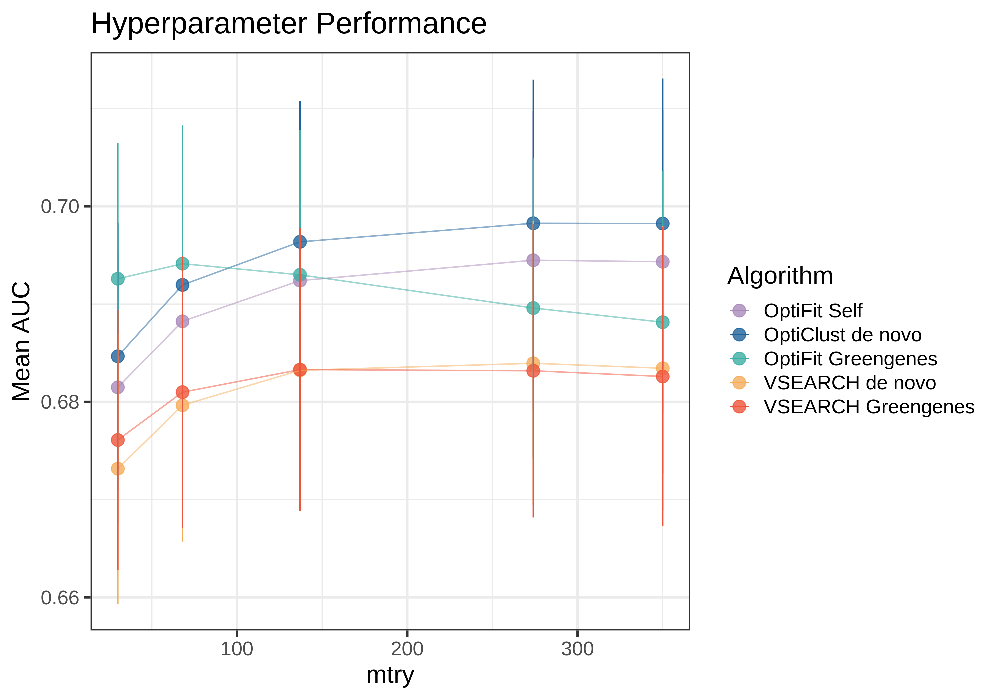

```{r setup, include=FALSE}
knitr::opts_chunk$set(echo = FALSE,message=FALSE)

library(tidyverse)
library(kableExtra)
#library(caret)
#library(pROC)
```

### Table of Contents

-   [Project Summary](#summary)
-   [Overview of data splits](#splits)
-   [Percent of reads mapped with optifit](#pct_mapped)
-   [MCC Optifit vs OptiClust](#mcc)
-   [Percent of reads mapped vs MCC](#pct_v_mcc_ref)
-   [Hyperparameter Performance](#hp_performance)
-   [Performance during training](#cv_auc)
-   [Performance on test data](#test_auc)
-   [Average ROC curves](#avg_roc)
-   [Correct Classification Frequency](#class_correct_freq)

### Project Summary {#summary}
...explanation of project....

### Overview of data splits {#splits}

Since the random 80% training 20% testing splits are generated 100 times, we anticipate that if the samples are randomly assigned each one should appear in the training set about 80 of the 100 times (80%) and testing about 20 of the 100 times (20%). The plot below visualizes how many times each sample appears in the training and testing datasets.

```{r plot_splits,out.width="50%"}
knitr::include_graphics("../results/figures/view_splits.png")
```
  
### Percent of reads mapped with OptiFit {#pct_mapped}

```{r pct_mapped}
pct_mapped <- read_tsv("../results/tables/fraction_reads_mapped.tsv") %>% 
  rename(split=sample) %>% 
  mutate(algorithm="optifit") %>% 
  mutate(split=paste0("split_",split))

# ggplot(pct_mapped,aes(x=algorithm,y=fraction_mapped)) + 
#   geom_jitter(width=0.2,color="blue",size=3,alpha = 0.5) +
#   stat_summary(fun.data=median_hilow, fun.args=0.5, geom="crossbar", width=0.5, color="black") +
#   theme_bw() +
#   xlab("") + ylab("Fraction of Reads Mapped with OptiFit") +
#   scale_y_continuous(limits=c(.98,1),labels = scales::percent_format(accuracy=0.1))


highest_pct_mapped <- pct_mapped %>% 
  filter(fraction_mapped == max(fraction_mapped)) %>% 
  pull(split)
lowest_pct_mapped <- pct_mapped %>% 
  filter(fraction_mapped == min(fraction_mapped)) %>% 
  pull(split)

ggplot(pct_mapped,aes(x=fraction_mapped)) + 
  geom_histogram(color="black",fill="grey") +
  theme_bw() +
  xlab("Percent of Reads Mapped with OptiFit") +
  scale_x_continuous(labels = scales::percent_format(accuracy = 0.1)) +
  scale_y_continuous(expand=c(0,0)) +
  geom_text(x=max(pct_mapped$fraction_mapped),y=1.5,label=highest_pct_mapped,hjust=0.25,size=3) +
  geom_text(x=min(pct_mapped$fraction_mapped),y=1.5,label=lowest_pct_mapped,hjust=0.5,size=3)


```

### MCC OptiFit vs OptiClust {#mcc}

```{r mcc}
merged_mcc <- read_csv("../data/learning/summary/merged_MCC.csv") %>% 
  mutate(label = case_when(algorithm == "opticlust" ~ algorithm,
                           TRUE ~ paste0(algorithm,"_",subset))) %>% 
  mutate(color=case_when(algorithm == "opticlust" ~ "OptiClust",
                         subset == "train" ~ "OptiFit Reference",
                         state == "fit" ~ "Optifit Fit without Reference",
                         TRUE ~ "Optifit Fit with Reference")) %>% 
  mutate(label = factor(label,levels=c("opticlust","optifit_train","optifit_test"),
                        labels = c("OptiClust","OptiFit Train","OptiFit Test")))

merged_mcc %>% 
  ggplot(aes(x=label,y=mcc,color=color)) +
    geom_jitter(height=0,width=0.2,alpha=0.5,size=3) +
    theme_bw() +
    xlab("") + ylab("MCC") +
    theme(panel.grid.major.y = element_line(color="grey85"),
          panel.grid.minor.y = element_line(color="grey85"),
          panel.grid.major.x = element_blank()) +
    geom_text(aes(label,mcc,label=split),data=subset(merged_mcc, mcc < 0.7),color="black",hjust=0) #+
    # geom_text(aes(label,mcc,label=split),data=subset(merged_mcc, split == lowest_pct_mapped),color="black",hjust=0) +
    # geom_text(aes(label,mcc,label=split),data=subset(merged_mcc, split == highest_pct_mapped),color="black",hjust=0)

```

### Percent Mapped VS MCC (without reference) {#pct_v_mcc_ref}
```{r pct_map_v_mcc_ref}

sub_pct <- pct_mapped %>% 
  select(split,fraction_mapped)

mcc_pct <- merged_mcc %>% 
  filter(algorithm == "optifit" & subset == "test",state == "fit") %>% 
  select(split,mcc) %>% 
  inner_join(., sub_pct ,by="split") 

mcc_pct %>% 
  ggplot(aes(x=fraction_mapped,y=mcc)) +
    geom_point(size=2,alpha = 0.5) +
    theme_bw() +
    xlab("Percent of Reads Mapped with OptiFit") +
    ylab("OptiFit MCC (printref=f)") +
    geom_text(aes(fraction_mapped,mcc,label=split),
              data=subset(mcc_pct, (fraction_mapped > 0.997 | fraction_mapped < 0.98)),
              color="black",vjust=-1,size=3) +
    geom_text(aes(fraction_mapped,mcc,label=split),
              data=subset(mcc_pct, (mcc > 0.775 | mcc < 0.7)),
              color="black",vjust=-1,size=3)
```

### Percent Mapped VS MCC (WITH reference) {#pct_v_mcc_noref}
```{r pct_map_v_mcc}

sub_pct <- pct_mapped %>% 
  select(split,fraction_mapped)

mcc_pct <- merged_mcc %>% 
  filter(algorithm == "optifit" & subset == "test",state == "combo") %>% 
  select(split,mcc) %>% 
  inner_join(., sub_pct ,by="split") 

mcc_pct %>% 
  ggplot(aes(x=fraction_mapped,y=mcc)) +
    geom_point(size=2,alpha = 0.5) +
    theme_bw() +
    xlab("Percent of Reads Mapped with OptiFit") +
    ylab("OptiFit MCC (printref=t)") +
    geom_text(aes(fraction_mapped,mcc,label=split),
              data=subset(mcc_pct, (fraction_mapped > 0.997 | fraction_mapped < 0.98)),
              color="black",vjust=-1,size=3) +
    geom_text(aes(fraction_mapped,mcc,label=split),
              data=subset(mcc_pct, (mcc > 0.8961 | mcc < 0.8905)),
              color="black",vjust=-1,size=3)
```

### HP performance {#hp_performance}  

```{r hp}
# hp_performance <- read_csv("../data/learning/summary/merged_HP.csv",
#                            col_types = cols(split=col_character(),
#                                             algorithm=col_character(),
#                                             .default=col_double()))
# hp_performance %>% 
#   group_by(mtry,algorithm) %>% 
#   summarise("mean_AUC" = mean(AUC),
#             "sd_AUC" = sd(AUC),
#             ymin_metric = mean_AUC - sd_AUC,
#             ymax_metric = mean_AUC + sd_AUC)
# ggplot(hp_performance,aes(x=mtry,y=AUC,color=algorithm)) +
#   geom_point() +
#   facet_wrap(.~algorithm)

```
  
### Model performance during training {#cv_auc}

```{r cv_auc}
#allCV <- read_csv("../data/learning/summary/merged_CV.csv")
allCV <- read.csv("../data/learning/summary/merged_performance.csv")

meds <- allCV %>% 
  group_by(algorithm) %>% 
  summarise(median_CV_AUC = round(median(cv_metric_AUC),digits=3)) 

ggplot(allCV,aes(x=algorithm,y=cv_metric_AUC,color=algorithm)) +
  geom_jitter(width = 0.2,size=3,alpha = 0.5) +
  stat_summary(fun.data=median_hilow, fun.args=0.5, geom="crossbar", width=0.5, color="black") +
  theme_bw() +
  ylab("Cross-Validation AUC") +
  geom_text(data=meds,aes(x=algorithm,y=median_CV_AUC,label=median_CV_AUC),
            color="black",hjust=-2)

allCV %>% 
  select(cv_metric_AUC,split,algorithm) %>% 
  pivot_wider(id_cols = split,names_from = algorithm,values_from = cv_metric_AUC) %>% 
  mutate(diff = opticlust-optifit) %>% 
  mutate(change_from_opticlust = case_when(diff >= 0.01 ~ "decrease",
                                           diff <= -0.01 ~ "increase",
                                           TRUE ~ "less than |0.01|")) %>% 
  pivot_longer(cols = c("opticlust","optifit"),names_to="algorithm",values_to = "cv_metric_AUC") %>% 
  ggplot(aes(x=algorithm,y=cv_metric_AUC,color=change_from_opticlust,group=split)) +
    geom_point(size=3,alpha = 0.5) +
    geom_line(alpha = 0.5) +
    theme_bw() +
    scale_color_manual(values = c("red","blue","grey")) +
    ylab("Cross-Validation AUC") 
  
# ggplot(allCV,aes(x=algorithm,y=cv_metric_AUC,color=split,group=split)) +
#     geom_point(size=3,alpha = 0.5) +
#     geom_line() +
#     theme_bw() +
#     ylab("Cross-Validation AUC") +
#     theme(legend.position = "none")
```
                         
### Model performance on test data {#test_auc}


```{r sens_spec}
all_sens_spec <- read_csv("../data/learning/summary/all_sens_spec.csv",
                          col_types = cols(algorithm=col_character(),
                                           .default=col_double()))
```

```{r test_auc}
allAUCs <- read_csv("../data/learning/summary/merged_performance.csv",
                    col_types = cols(algorithm=col_character(),
                                     method=col_character(),
                                     split=col_character(),
                                     .default=col_double())) 
meds <- allAUCs %>% 
  group_by(algorithm) %>% 
  summarise(median_AUC = round(median(AUC),digits=3)) 

ggplot(allAUCs,aes(x=algorithm,y=AUC,color=algorithm)) +
  geom_jitter(height=0,width=0.2,alpha = 0.7,size=2) + 
  stat_summary(fun.data=median_hilow, fun.args=0.5, geom="crossbar", width=0.5, color="black") +
  theme_bw() +
  ylab("AUC") +
  xlab("") +
  theme(legend.position = "top") +
  geom_text(data=meds,aes(x=algorithm,y=median_AUC,label=median_AUC),
            color="black",hjust=-2.8)
```

### Averaged ROC Curve {#avg_roc}

```{r avg_roc}
# calculate average/sd sensitivity
avg_sens <- all_sens_spec %>%
  group_by(specificity,algorithm) %>%
  summarise(mean_sensitivity = mean(sensitivity),
            sd_sensitivity = sd(sensitivity),
            .groups = "drop") %>%
  mutate(upper_sens = mean_sensitivity + sd_sensitivity,
         lower_sens = mean_sensitivity - sd_sensitivity) %>%
  mutate(upper_sens = case_when(upper_sens > 1 ~ 1,
                                TRUE ~ upper_sens),
         lower_sens = case_when(upper_sens < 0 ~ 0,
                                TRUE ~ lower_sens)) %>%
  mutate(fpr = 1-specificity)

# plot all levels together
avg_sens %>%
  ggplot(aes(x=fpr,y=mean_sensitivity,
             ymin=lower_sens,ymax=upper_sens)) +
  geom_line(aes(color=algorithm),alpha=0.7,lwd=1) +
  geom_ribbon(aes(fill=algorithm),alpha=0.3) +
  coord_equal() +
  geom_abline(intercept = 0,lty="dashed",color="grey50") +
  scale_x_continuous(expand = c(0,0)) +
  scale_y_continuous(expand = c(0,0)) +
  xlab("False Positive Rate") +
  ylab("Average True Positive Rate") +
  #facet_wrap(~level,ncol=3) +
  #scale_x_reverse(expand = c(0,0),labels = scales::percent_format(accuracy = 1)) +
  theme_classic() +
  theme(legend.position = "top",
        axis.text = element_text(size=11),
        axis.title = element_text(size=12),
        axis.text.x = element_text(vjust = -0.5),
        axis.title.x = element_text(vjust= -0.5)) +
  guides(color = guide_legend(nrow = 1,title=""),
         fill = guide_legend(nrow = 1,title="")) +
  scale_color_manual(values=c("brown3","deepskyblue3"))


allAUCs %>% 
  group_by(algorithm) %>% 
  summarize(median_AUC = round(median(AUC),3),
            mean_AUC = round(mean(AUC),3)) %>% 
  kableExtra::kable(col.names = c("Algorithm","Median AUC","Mean AUC"))
```

### Prediction Probabilities

```{r pred_prob,fig.width=7,fig.height=7}
# library(ggforce)
# 
# mergedProb <- read_csv("../data/learning/summary/merged_predictions.csv",
#                        col_types = cols(cancer=col_double(),
#                                         normal=col_double(),
#                                         .default=col_character())) %>% 
#   mutate(GroupDX = paste0(Group," ",dx))
# 
# ids = c((mergedProb %>% filter(dx == "normal") %>% pull(Group))[1:5],
#         (mergedProb %>% filter(dx == "cancer") %>% pull(Group))[1:5])
# 
# ### NORMAL
# p <- mergedProb %>%
#   #filter(Group %in% ids) %>%
#   filter(dx == "normal") %>%
#   ggplot(aes(x=algorithm,y=cancer,color=algorithm)) +
#     geom_jitter(width = 0.2,height=0,alpha=0.5,size=1.8) +
#     facet_wrap_paginate(~GroupDX,ncol=5,nrow=5) +
#     theme_bw() +
#     geom_hline(yintercept = 0.5,lty="dashed",color="grey") +
#     ylab("Probability of SRN") + xlab("") +
#     #scale_y_continuous(limits=c(0,1),breaks=seq(0,1,0.2)) +
#     theme(axis.text.x = element_blank(),
#           axis.ticks.x = element_blank(),
#           strip.background = element_rect(fill="deepskyblue3", size=1, color="black"),
#           strip.text.x = element_text(face="bold", color="white"),
#           legend.position = "top")
# 
# ###
#   # plot <- mergedProb %>%
#   # filter(dx == "normal") %>%
#   # ggplot(aes(x=algorithm,y=cancer,color=algorithm)) +
#   #   geom_jitter(width = 0.2,height=0,alpha=0.5,size=1.8) +
#   #   facet_wrap_paginate(~GroupDX,ncol=5,nrow=5,page=1) +
#   #   theme_bw() +
#   #   geom_hline(yintercept = 0.5,lty="dashed",color="grey") +
#   #   ylab("Probability of SRN") + xlab("") +
#   #   #scale_y_continuous(limits=c(0,1),breaks=seq(0,1,0.2)) +
#   #   theme(axis.text.x = element_blank(),
#   #         axis.ticks.x = element_blank(),
#   #         strip.background = element_rect(fill="deepskyblue3", size=1, color="black"),
#   #         strip.text.x = element_text(face="bold", color="white"),
#   #         legend.position = "top")
#   # print(plot)
# ###
# 
# for( i in 1:n_pages(p)){
#   plot <- mergedProb %>%
#   #filter(Group %in% ids) %>%
#   filter(dx == "normal") %>%
#   ggplot(aes(x=algorithm,y=cancer,color=algorithm)) +
#     geom_jitter(width = 0.2,height=0,alpha=0.5,size=1.8) +
#     facet_wrap_paginate(~GroupDX,ncol=5,nrow=5,page=i) +
#     theme_bw() +
#     geom_hline(yintercept = 0.5,lty="dashed",color="grey") +
#     ylab("Probability of SRN") + xlab("") +
#     #scale_y_continuous(limits=c(0,1),breaks=seq(0,1,0.2)) +
#     theme(axis.text.x = element_blank(),
#           axis.ticks.x = element_blank(),
#           strip.background = element_rect(fill="deepskyblue3", size=1, color="black"),
#           strip.text.x = element_text(face="bold", color="white"),
#           legend.position = "top")
#   print(plot)
# }
# 
# ### CANCER
# p <- mergedProb %>%
#   #filter(Group %in% ids) %>%
#   filter(dx == "cancer") %>%
#   ggplot(aes(x=algorithm,y=cancer,color=algorithm)) +
#     geom_jitter(width = 0.2,height=0,alpha=0.5,size=1.8) +
#     facet_wrap_paginate(~GroupDX,ncol=6,nrow=5) +
#     theme_bw() +
#     geom_hline(yintercept = 0.5,lty="dashed",color="grey") +
#     ylab("Probability of SRN") + xlab("") +
#     #scale_y_continuous(limits=c(0,1),breaks=seq(0,1,0.2)) +
#     theme(axis.text.x = element_blank(),
#           axis.ticks.x = element_blank(),
#           strip.background = element_rect(fill="brown3", size=1, color="black"),
#           strip.text.x = element_text(face="bold", color="white"),
#           legend.position = "top")
# 
# for( i in 1:n_pages(p)){
#   plot <- mergedProb %>%
#   #filter(Group %in% ids) %>%
#   filter(dx == "cancer") %>%
#   ggplot(aes(x=algorithm,y=cancer,color=algorithm)) +
#     geom_jitter(width = 0.2,height=0,alpha=0.5,size=1.8) +
#     facet_wrap_paginate(~GroupDX,ncol=6,nrow=5,page=i) +
#     theme_bw() +
#     geom_hline(yintercept = 0.5,lty="dashed",color="grey") +
#     ylab("Probability of SRN") + xlab("") +
#     #scale_y_continuous(limits=c(0,1),breaks=seq(0,1,0.2)) +
#     theme(axis.text.x = element_blank(),
#           axis.ticks.x = element_blank(),
#           strip.background = element_rect(fill="brown3", size=1, color="black"),
#           strip.text.x = element_text(face="bold", color="white"),
#           legend.position = "top")
#   print(plot)
# }
# 
# 

# mergedProb %>% 
#   #filter(Group %in% ids) %>% 
#   filter(dx == "cancer") %>% 
#   ggplot(aes(x=algorithm,y=cancer,color=algorithm)) +
#     geom_jitter(width = 0.2,height=0,alpha=0.7,size=1.8) +
#     facet_wrap(~GroupDX,ncol=5) +
#     theme_bw() +
#     geom_hline(yintercept = 0.5,lty="dashed",color="grey") +
#     ylab("Probability of SRN") +
#     theme(axis.text.x = element_text(angle=45,hjust=1),
#           strip.background = element_rect(fill="brown3", size=1, color="black"),
#           strip.text.x = element_text(face="bold", color="white"))
# 
```

```{r prob_hist,include=F}
# mergedProb %>% 
#   #filter(Group %in% ids) %>% 
#   filter(dx == "normal") %>% 
#   mutate(GroupDX = paste0(Group," ",dx)) %>% 
#   ggplot(aes(x=cancer,fill=algorithm)) +
#     geom_histogram(binwidth = 0.05,color="black") +
#     geom_vline(xintercept=0.5,lty="dashed",color="grey") +
#     facet_wrap(~GroupDX,ncol=5) +
#     xlab("Probability of SRN") +
#     ylab("Number of Splits") +
#     theme_bw() +
#     scale_y_continuous(expand=c(0,0)) +
#     scale_x_continuous(limits=c(0,1),labels = scales::percent_format(accuracy=1)) +
#     theme(axis.text.x = element_text(angle=45),
#           strip.background = element_rect(fill="deepskyblue3", size=1, color="black"),
#           strip.text.x = element_text(face="bold", color="white"))
# mergedProb %>% 
#   #filter(Group %in% ids) %>% 
#   filter(dx == "cancer") %>% 
#   mutate(GroupDX = paste0(Group," ",dx)) %>% 
#   ggplot(aes(x=cancer,fill=algorithm)) +
#     geom_histogram(binwidth = 0.05,color="black") +
#     geom_vline(xintercept=0.5,lty="dashed",color="grey") +
#     facet_wrap(~GroupDX,ncol=5) +
#     xlab("Probability of SRN") +
#     ylab("Number of Splits") +
#     theme_bw() +
#     scale_y_continuous(expand=c(0,0)) +
#     scale_x_continuous(limits=c(0,1),labels = scales::percent_format(accuracy=1)) +
#     theme(axis.text.x = element_text(angle=45),
#           strip.background = element_rect(fill="brown3", size=1, color="black"),
#           strip.text.x = element_text(face="bold", color="white"))

```

```{r prob_diff,include=F}

# mergedProb %>% 
#   #group_by(Group,dx,algorithm,split) %>%   
#   #filter(Group %in% ids) %>% 
#   pivot_wider(id_cols=c("Group","dx","split"),names_from = algorithm,values_from = cancer) %>% 
#   mutate(diff = opticlust - optifit) %>% 
#   ggplot(aes(x=diff,fill=dx,color=dx)) +
#     geom_histogram(alpha=0.7) +
#     facet_wrap(~Group) +
#     geom_vline(xintercept = 0,lty="dashed",color="grey") +
#     xlab("Cancer Probability Difference (OptiClust - OptiFit)") +
#     scale_y_continuous(expand=c(0,0)) +
#     theme_bw() +
#     scale_fill_manual(values=c("brown3","deepskyblue3"),name="Actual Diagnosis") +
#     scale_color_manual(values=c("brown3","deepskyblue3"),name="Actual Diagnosis")

```

### Correct Classification Frequency {#class_correct_freq}

```{r pct_correct}
pct_correct <- read_csv("../results/tables/pct_class_correct.csv")

pct_correct %>%
  ggplot(aes(x=factor(algorithm,levels=c("opticlust","optifit"),labels=c("OptiClust","OptiFit")),
             y=pct_correct,group=Group,color=dx)) +
    geom_jitter(height=0,width=0.2,alpha=0.7,size=1.8) +
    theme_bw() + xlab("") +
    ylab("Percent of splits sample is correctly classified (TP or TN)") +
    scale_y_continuous(labels = scales::percent_format(accuracy=1),
                       breaks = seq(0,1,0.1)) +
    theme(panel.grid.major.y = element_line(color="grey85")) +
    scale_color_manual(values=c("brown3","deepskyblue3"),name="Actual Diagnosis")

```
```{r test}
# 
# get_categories <- function(filename,threshold){
#   read_csv(filename,col_types = cols(Group = col_character(),
#                                     dx = col_character(),
#                                     .default = col_double())) %>% 
#     mutate(algorithm = str_replace(filename,
#                                    "../data/learning/results/(.*)/prediction_results_split_(\\d*).csv", "\\1"),
#            split = str_replace(filename,
#                                "../data/learning/results/(.*)/prediction_results_split_(\\d*).csv", "\\2"),
#            pred_dx = case_when(cancer > threshold ~ "cancer",
#                                TRUE ~ "normal")) %>% 
#     filter(Group %in% c("2005650","2009650","2025653","2671660")) %>% 
#     select(Group,dx,pred_dx,algorithm,split) %>% 
#     mutate(category = case_when(dx == "normal" & pred_dx == "normal" ~ "TN",
#                                 dx == "normal" & pred_dx == "cancer" ~ "FP",
#                                 dx == "cancer" & pred_dx == "cancer" ~ "TP",
#                                 dx == "cancer" & pred_dx == "normal" ~ "FN",
#                                 TRUE ~ "NA"))
# }
# 
# get_pct_correct <- function(algorithm, threshold){
#   #get_pred_file_list(algorithm) %>% 
#   filelist <- c("../data/learning/results/optifit/prediction_results_split_1.csv",
#                 "../data/learning/results/optifit/prediction_results_split_2.csv",
#                 "../data/learning/results/optifit/prediction_results_split_3.csv",
#                 "../data/learning/results/optifit/prediction_results_split_4.csv",
#                 "../data/learning/results/optifit/prediction_results_split_5.csv")
  # filelist <- c("../data/learning/results/optifit/prediction_results_split_1.csv",
  #               "../data/learning/results/optifit/prediction_results_split_2.csv",
  #               "../data/learning/results/optifit/prediction_results_split_3.csv",
  #               "../data/learning/results/optifit/prediction_results_split_4.csv",
  #               "../data/learning/results/optifit/prediction_results_split_5.csv")
#   filelist %>% 
#     map_dfr(get_categories,threshold) %>% 
#     select(Group,category,dx) %>%
#     group_by(Group,dx) %>% 
#     count(category) %>% 
#     pivot_wider(id_cols=c("Group","dx"),names_from=category,values_from=n,values_fill=0) %>% 
#     mutate(correct = TN + TP,
#            incorrect = FN + FP,
#            total = TN + TP + FN + FP) %>% 
#     mutate(pct_correct = correct/total) %>% 
#     select(Group,dx,pct_correct) %>% 
#     mutate(algorithm = algorithm)
# }
# 
# pct_correct <- map_dfr(algorithms, get_pct_correct, threshold=0.5) %>% 
#   mutate(Group=as.character(Group))
# 
# pct_correct %>% 
#   ggplot(aes(x=algorithm,y=pct_correct,group=Group,color=dx)) +
#     geom_jitter(height=0,width=0.2) +
#     theme_bw() +
#     ylab("Percent of splits sample is correctly classified (TP or TN)")


```


```{r }

### Prediction Probability 
# opticlust_summary %>% 
#   ggplot(aes(x=cancer,fill=meta_class)) +
#     geom_histogram(color="black",alpha=0.8,binwidth = 0.05) + theme_bw() +
#     labs(xlab = "Probability of Cancer") + 
#     facet_wrap(~meta_class) +
#     xlab("probability of cancer") +
#     geom_vline(xintercept = 0.5,lty="dashed") +
#     scale_y_continuous(expand=c(0,0)) +
#     scale_fill_manual(values=c("red","blue"),guide=NULL) +
#     ggtitle("OptiClust")

# optifit_summary %>% 
#   ggplot(aes(x=cancer,fill=meta_class)) +
#     geom_histogram(color="black",alpha=0.8,binwidth = 0.05) + theme_bw() +
#     labs(xlab = "Probability of Cancer") + 
#     facet_wrap(~meta_class) +
#     xlab("probability of cancer") +
#     geom_vline(xintercept = 0.5,lty="dashed") +
#     scale_y_continuous(expand=c(0,0)) +
#     scale_fill_manual(values=c("red","blue"),guide=NULL) +
#     ggtitle("OptiFit")


```


```{r }
### Difference in prediction probablity  
# ggplot(opticlust_summary,aes(x=dx_diff)) +
#   geom_histogram(binwidth = 0.05,color="black",fill="grey") +
#   labs(title = "OptiClust: Difference in DX Prediction",
#        x="Difference in Probability") +
#   theme_bw() +
#   scale_x_continuous(expand=c(0,0)) +
#   scale_y_continuous(expand=c(0,0))
# 
# ggplot(optifit_summary,aes(x=dx_diff)) +
#   geom_histogram(binwidth = 0.05,color="black",fill="grey") +
#   labs(title = "OptiFit: Difference in DX Prediction",
#        x="Difference in Probability") +
#   theme_bw() +
#   scale_x_continuous(expand=c(0,0)) +
#   scale_y_continuous(expand=c(0,0))

# opticlust_summary %>% mutate(method="OptiClust") %>% 
#   bind_rows(optifit_summary %>% mutate(method="OptiFit")) %>% 
#   ggplot(aes(x=dx_diff)) +
#     geom_histogram(binwidth = 0.05,color="black",fill="grey") +
#     labs(title = "Difference in DX Prediction",
#          x="Difference in Probability") +
#     theme_bw() +
#     scale_x_continuous(expand=c(0,0)) +
#     scale_y_continuous(expand=c(0,0)) +
#     facet_wrap(~method)

```


```{r }
### Summary of performance with a threshold of 0.5
# opticlust_cm <- confusionMatrix(data=factor(opticlust_summary$pred_class),reference = factor(opticlust_summary$meta_class))
# optifit_cm <- confusionMatrix(data=factor(optifit_summary$pred_class),reference = factor(optifit_summary$meta_class))

# kable(opticlust_cm$table,caption="OptiClust Confusion Matrix") %>% 
#   kable_styling(full_width = F,position = "float_left")
# kable(optifit_cm$table,caption="OptiFit Confusion Matrix") %>% 
#   kable_styling(full_width = F,position = "left")

# cm_summary <- round(opticlust_cm$byClass,digits=3) %>% 
#   bind_rows(round(optifit_cm$byClass,digits=3)) %>% 
#   mutate(Method=c("OptiClust","OptiFit")) %>% 
#   select(Method,everything())

# kable(cm_summary,align="c",booktabs=TRUE) %>% 
#   kable_classic()
```


```{r }
### ROC plot  
#opticlust
# response <- ifelse(opticlust_summary$meta_class == "cancer",1,0)
# predictor <- opticlust_summary$cancer
  
# clust_roc <- roc(response,predictor)
# opticlust_thr <- coords(clust_roc, "best", ret = "threshold",transpose = TRUE)

# #optifit
# response <- ifelse(optifit_summary$meta_class == "normal",0,1)
# predictor <- optifit_summary$normal
  
# fit_roc <- roc(response,predictor)
# optifit_thr <- coords(fit_roc, "best", ret = "threshold",transpose = TRUE)

# #plot
# ggroc(list(OptiClust=clust_roc,OptiFit=fit_roc),legacy.axes=TRUE) +
#   theme_bw() + 
#   geom_segment(aes(x = 0, xend = 1, y = 0, yend = 1),
#                  color="darkgrey", linetype="dashed") +
#   scale_y_continuous(expand=c(0,0)) +
#   scale_x_continuous(expand=c(0,0))

```

```{r}
# OptiClust AUC: `r round(clust_roc$auc,digits=3)`  
# OptiFit AUC: `r round(fit_roc$auc,digits=3)`

# Optimal threshold for OptiClust: `r round(opticlust_thr,digits=3)`  
# Optimal threshold for OptiFit: `r round(optifit_thr,digits=3)`  
```
