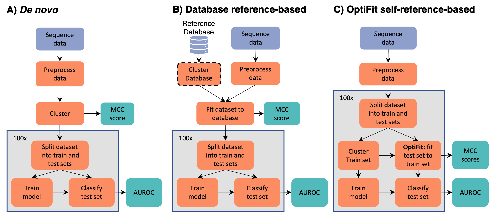

```{r settings, eval=TRUE, echo=FALSE, cache=FALSE, include=FALSE}
library(tidyverse)
library(knitr)
opts_chunk$set("tidy" = TRUE)
opts_chunk$set("echo" = FALSE)
opts_chunk$set("eval" = TRUE)
opts_chunk$set("warning" = FALSE)
opts_chunk$set("cache" = FALSE)


format_decimal <- function(number,digits){
  return(round(number,digits=digits))
}

```

Running title: Reference-based OTU clustering for ML classification

\vspace{10mm}

Courtney R. Armour${^1}$, Kelly L. Sovacool${^2}$, William L.
Close$^{1,*}$, Begüm D. Topçuoğlu$^{1,\#}$, Jenna Wiens${^3}$, Patrick
D. Schloss $^{1,\dagger}$

\vspace{10mm}

${^1}$ Department of Microbiology and Immunology, University of
Michigan, Ann Arbor, Michigan, USA

${^2}$ Department of Computational Medicine and Bioinformatics,
University of Michigan, Ann Arbor, Michigan, USA

${^3}$ Department of Electrical Engineering and Computer Science,
University of Michigan, Ann Arbor, Michigan, USA

${^*}$ Current Affiliation: Bio-Rad Laboratories, Hercules, California,
USA

${^\#}$ Current Affiliation: Bristol Myers Squibb, Summit, New Jersey,
USA

$\dagger$ To whom correspondence should be addressed:
[pschloss\@umich.edu](mailto:pschloss@umich.edu)

\vspace{10mm}

**observation format** (max 1200 words, 2 figures, 25 ref)

\newpage

\linenumbers

## Abstract

Machine learning classification using the gut microbiome relies on
assigning 16S rRNA gene sequences into operational taxonomic units
(OTUs) to quantify microbial composition. OTU abundances are then used
to train a classification model that can be applied to classify new
samples. The standard approaches to clustering sequences include
reference-based and *de novo* clustering. Reference-based clustering
requires a well-curated reference database that may not exist for all
systems. *De novo* clustering tends to produce higher quality OTU
assignments than reference-based, but clusters depend on the sequences
in the dataset and therefore OTU assignments will change when new
samples are sequenced. This lack of stability complicates machine
learning classification since new sequences must be reclustered with the
old data and the model retrained with the new OTU assignments. The
OptiFit algorithm addresses these issues by fitting new sequences into
existing OTUs. While OptiFit produces high quality OTU clusters, it is
unclear whether this method for fitting new sequence data into existing
OTUs will impact the performance of classification models trained with
the older data. We used OptiFit to cluster sequences into existing OTUs
and evaluated model performance in classifying a dataset containing
samples from patients with and without colonic screen relevant neoplasia
(SRN). We compared the performance of this model to standard methods
including *de novo* and database-reference-based clustering. We found
that using OptiFit performed as well or better in classifying SRNs.
OptiFit can streamline the process of classifying new samples by
avoiding the need to retrain models using reclustered sequences.

## Importance

There is great potential for using microbiome data to aid in diagnosis.
A challenge with OTU-based classification models is that 16S rRNA gene
sequences are often assigned to OTUs based on similarity to other
sequences in the dataset. If data are generated from new patients, the
old and new sequences must all be reassigned to OTUs and the
classification model retrained. Yet there is a desire to have a single,
validated model that can be widely deployed. To overcome this obstacle,
we applied the OptiFit clustering algorithm to fit new sequence data to
existing OTUs allowing for reuse of the model. A random forest model
implemented using OptiFit performed as well as the traditional reassign
and retrain approach. This result shows that it is possible to train and
apply machine learning models based on OTU relative abundance data that
do not require retraining or the use of a reference database.

\newpage

There is increasing evidence for an association between the composition of the gut microbiome and a variety of diseases, such as crohn's disease and colorectal cancer. The signatures that associate with disease have shown potential to aid in diagnosis of disease throught gut microbiome profiling and machine learning. Taxonomic composition of microbial
communities can be assessed using amplicon sequencing of the 16S rRNA
gene, which is the input to classification models. Analysis of 16S rRNA
gene sequence data generally relies on assigning sequences into
operational taxonomic units (OTUs). The process of OTU clustering can
either be reference-based or *de novo*. The quality of OTUs generated
with reference-based clustering is generally poor compared to those
generated with *de novo* clustering @westcott2015. While *de novo*
clustering produces high-quality OTU clusters where sequences are
accurately grouped based on similarity thresholds, the resulting OTU
clusters depend on the sequences within the dataset and the addition of
new data has the potential to redefine OTU cluster composition. The
unstable nature of *de novo* OTU clustering complicates deployment of
machine learning models since integration of additional data requires
reclustering all the data and retraining the model. The ability to
integrate new data into a validated model without reclustering and
retraining could allow for the application of a single model that can
continually classify new data. Recently, Sovacool *et al.* introduced
OptiFit, a method for fitting new sequence data into existing OTUs
@sovacool2022. While OptiFit can effectively fit new sequence data to
existing OTU clusters, it is unknown if the use of OptiFit will have an
impact on classification performance. Here, we tested the ability of
OptiFit to cluster new sequence data into existing OTU clusters for the
purpose of classifying disease based on gut microbiome composition.

We compared the ability of several approaches for assigning 16S rRNA
gene seequences to OTUs including, *de novo*, database-reference-based,
and self-reference-based with OptiFit. To test how the model performance
compared between these approaches, we used a publicly available dataset
of 16S rRNA gene sequences from stool samples of healthy subjects (n =
226) as well as subjects with screen-relevant neoplasia (SRN) consisting
of advanced adenoma and carcinoma (n = 229) @baxter2016. For the *de
novo* workflows, all the 16S rRNA sequence data was clustered into OTUs.
The OTU clustering was conducted using two common algorithms: 1) the
OptiClust algorithm in mothur @westcott2017 and 2) the VSEARCH algorithm
used in QIIME2 [@rognes2016; @bolyen2019]. For both algorithms, the
resulting abundance data was then split into training and testing sets,
where the training set was used to tune hyperparameters and ultimately
train and select the model. The model was applied to the testing set and
performance evaluated (Figure 1A). We also conducted reference-based OTU
clustering using OptiFit to fit the sequence data into OTUs based on the
greengenes reference database. To compare with another commonly used
method, we also used the VSEARCH algorithm to fit the sequence data to
the greengenes reference (Figure 1B). In the OptiFit self-reference
workflow, the data was split into a training and a testing set. The
training set was clustered into OTUs and used to train a classification
model. The OptiFit algorithm was used to fit sequence data of samples
not part of the original dataset into the existing OTUs, and used the
same model to classify the samples (Figure 1C). For each of the
workflows the process was repeated for 100 random splits of the data to
account for variation caused by the choice of the random number
generator seed.

```{r mcc, include=F}
merged_mcc <- read_csv("../results/ml/summary/merged_mcc.csv")

opticlust_denovo_mcc <- merged_mcc %>% 
  filter(algorithm == "opticlust_denovo") %>% 
  pull(mcc) %>% round(digits=3)

optifit_self_avg_mcc <- merged_mcc %>% 
  filter(algorithm == "optifit_self" & state=="combo") %>% 
  summarise(mean_mcc = mean(mcc),
            sd_mcc = sd(mcc)) %>% 
  round(digits=3)

optifit_gg_mcc <- merged_mcc %>% 
  filter(algorithm == "optifit_gg") %>% 
  pull(mcc) %>% round(digits=3)

vsearch_denovo_mcc <- merged_mcc %>% 
  filter(algorithm == "vsearch_denovo") %>% 
  pull(mcc) %>% round(digits=3)

vsearch_gg_mcc <- merged_mcc %>% 
  filter(algorithm == "vsearch_gg") %>% 
  pull(mcc) %>% round(digits=3)
```

```{r frac_mapped, include=F}
counts <- read_csv("../results/tables/counts.csv") 

avg_frac_mapped <- counts %>%
  mutate(frac_mapped = count/10000 * 100) %>%
  group_by(methods,set) %>%
  summarize(mean_frac = mean(frac_mapped),
            sd_frac = sd(frac_mapped),
            .groups="drop") %>% 
  filter(set == "test") 
```

We first examined the quality of the resulting OTU clusters from each
method using the Matthews correlation coefficient (MCC). MCC is a metric
used to measure OTU cluster quality based on the similarity of all pairs
of sequences and whether they are appropriately clustered or not
@westcott2015. MCC scores range between negative one and one, and
measure how well clustering assignment correlates with the distance
between sequences. To ensure that OptiFit appropriately integrated new
sequence data into the existing OTUs, we expected the MCC scores
produced by the OptiFit workflow to be similar to that of *de novo*
clustering using the OptiClust algorithm. In the OptiFit workflow the
test data was fit to the clustered training data for each of the 100
data splits resulting in an MCC score for each split of the data. In the
remaining workflows, the data was only clustered once and then split
into the training and testing sets resulting in a single MCC score for
each method. Indeed, the MCC scores were similar between the OptiClust
*de novo* (MCC = `r opticlust_denovo_mcc`) and OptiFit self-reference
workflows (average MCC = `r optifit_self_avg_mcc %>% pull(mean_mcc)`,
standard deviation = `r optifit_self_avg_mcc %>% pull(sd_mcc)`).
Previously, we observed that *de novo* clustering tends to produce
higher MCC scores than reference-based clustering @sovacool2022.
Consistent with prior findings the reference-based methods produced
lower MCC scores (OptiFit Greengenes MCC = `r optifit_gg_mcc`; VSEARCH
Greengenes MCC = `r vsearch_gg_mcc`) than the *de novo* methods with the
same algorithm (OptiClust *de novo* MCC = `r opticlust_denovo_mcc`;
VSEARCH *de novo* MCC = `r vsearch_denovo_mcc`). Another metric we
examined for the OptiFit workflow was the fraction of sequences from the
test set that mapped to the reference OTUs. Since sequences that did not
map to reference OTUs were eliminated, if a high percentage of reads did
not map to an OTU we expected this loss of data to negatively impact
classification performance. We found that loss of data was not an issue
since on average
`r avg_frac_mapped %>% filter(methods == "optifit_self", set == "test") %>% pull(mean_frac) %>% round(digits=1)`%
(standard deviation =
`r avg_frac_mapped %>% filter(methods == "optifit_self", set == "test") %>% pull(sd_frac) %>% round(digits=2)`%)
of sequences in the test set mapped to the reference OTUs. This number
is higher than the average fraction of reads mapped in the OptiFit
Greengenes workflow (
`r avg_frac_mapped %>% filter(methods == "optifit_gg",set == "test") %>% pull(mean_frac) %>% round(digits=1)`%
+/-
`r avg_frac_mapped %>% filter(methods == "optifit_gg", set == "test") %>% pull(sd_frac) %>% round(digits=1)`).
These results indicate that the OptiFit self-reference method performed
as well as the OptiClust *de novo* method and better than using an
external database.

```{r}
performance <- read_csv("../results/ml/summary/merged_performance.csv",
                    col_types = cols(algorithm=col_character(),
                                     method=col_character(),
                                     split=col_character(),
                                     .default=col_double())) 

performance_summary <- performance %>% 
  group_by(algorithm) %>% 
  summarise(median_cv_AUC = round(median(cv_metric_AUC),digits=3),
            mean_cv_AUC = round(mean(cv_metric_AUC),digits=3),
            sd_cv_AUC = round(sd(cv_metric_AUC),digits=3),
            median_AUC = round(median(AUC),digits=3),
            mean_AUC = round(mean(AUC),digits=3),
            sd_AUC = round(sd(AUC),digits=3))

pvals <- read_csv("../results/tables/pvalues.csv",col_types = cols(p_value = col_double(),
                                                                   .default = col_character())) 

get_pval <- function(pvals,met,g1,g2){
  pvals %>% 
    filter(metric == met) %>% 
    filter(group1 == g1 & group2 == g2 | group1 == g2 & group2 == g1) %>% 
    pull(p_value) %>% round(digits = 3)
}
```

We next assessed model performance using OTU relative abundances from
the training data from the workflows to train a model to predict SRNs
and used the model on the held out data. Using the predicted and actual
diagnosis classification, we calculated the area under the receiver
operating characteristic curve (AUROC) for each data split. During
cross-validation (CV) training, the model performance was equivalent
between OptFit self-reference and OptiClust *de novo* (p-value =
`r get_pval(pvals, "cv_metric_AUC", "opticlust_denovo", "optifit_self")`;
Figure 2A) while while performance for both VSEARCH methods was lower
than the OptiClust *de novo*, OptiFit self, and OptiFit Greengenes
methods (p-values \< 0.05). The trained model was then applied to the
test data classifying samples as either control or SRN. Both VSEARCH
methods perform slightly worse than the OptiClust \*de novo\* method
(both p-values \< 0.05). However the performance on the test data was
equivalent between the OptiClust *de novo*, OptiFit Greengenes, and
OptiFit self-reference approaches (p-value \> 0.05; Figures 2B and 2C).
These results indicate that new data could be fit to existing OTU
clusters using OptiFit without impacting model performance.

We tested the ability of OptiFit to integrate new data into existing
OTUs for the purpose of machine learning classification using OTU
relative abundance. A potential problem with using OptiFit is that any
sequences from the new samples that do not map to the existing OTU
clusters will be discarded, resulting in a possible loss of information.
However, we demonstrated that OptiFit can be used to fit new sequence
data into existing OTU clusters and it could perform as well in
predicting SRN compared to *de novo* clustering all the sequence data
together. In this instance, the performance of OptiFit was equivalent to
using a database-reference-based method despite the lower quality of the
OTU clusters in the database-reference-based approach. This likely
indicates that the sequences that are important to the model are well
characterized by the reference database. However, a less well studied
system may not be as well characterized by a reference-database which
would make the ability to utilize one's own data a reference an exciting
possiblility. The ability to integrate data from new samples into
existing OTUs enables the implementation of a single machine learning
model. This is important for model implementation because not all of the
data needs to be available or known at the time of model generation. A
robust machine learning model can be implemented as part of a
non-invasive and low-cost diagnostic for SRN and other diseases.

## Materials and Methods

**Dataset.** Raw 16S rRNA gene sequence data from the V4 region were
previously generated from human stool samples. Sequences were downloaded
from the NCBI Sequence Read Archive (accession no. SRP062005)
[@edgar2011; @baxter2016]. This dataset contains stool samples from 490
subjects. For this analysis, samples from subjects identified in the
metadata as normal, high risk normal, or adenoma were categorized as
"normal", while samples from subjects identified as advanced adenoma or
carcinoma were categorized as "screen relevant neoplasia" (SRN). The
resulting dataset consisted of 261 normal samples and 229 SRN samples.

```{r n_test_train,include=F}
n_test_train <- read_csv("../results/tables/train_test_frequency.csv") %>% 
  pivot_wider(names_from="train_test",values_from = "n") %>% 
  summarize(avg_test = mean(test),
            sd_test = sd(test),
            avg_train = mean(train),
            sd_train = sd(train))
```

**Data processing.** The full dataset was preprocessed with mothur
(v1.47) @schloss2009 to join forward and reverse reads, merge duplicate
reads, align to the SILVA reference database (v132) @quast2013,
precluster, remove chimeras with UCHIME @edgar2011, assign taxonomy, and
remove non-bacterial reads following the Schloss Lab MiSeq standard
operating procedure described on the mothur website
(<https://mothur.org/wiki/miseq_sop/>). 100 splits of the 490 samples
were generated where 80% of the samples (392 samples) were randomly
assigned to the training set and the remaining 20% (98 samples) were
assigned to the test set. Using 100 splits of the data accounts for the
variation that may be observed depending on the samples that are in the
training or test sets. Each sample was in the training set an average of
`r n_test_train %>% pull(avg_train)` times (standard deviation =
`r format_decimal(n_test_train %>% pull(sd_train),digits = 1)`) and the
test set an average of `r n_test_train %>% pull(avg_test)` times
(standard deviation =
`r format_decimal(n_test_train %>% pull(sd_test),digits = 1)`\`).

***Reference-based workflows.***

1.  OptiFit Self: The preprocess data was split into the training and
    testing sets. The training set was clustered into OTUs using
    OptiClust, then the test set was fit to the OTUs of the training set
    using the OptiFit algorithm @sovacool2022. The OptiFit algorithm
    was run with method open so that any sequences that did not map to
    the existing OTU clusters would form new OTUs. The data was then
    subsampled to 10,000 reads and any novel OTUs from the test set were
    removed. This process was repeated for each of the 100 splits
    resulting in 100 training and testing datasets.
2.  OptiFit Greengenes: Reference sequences from the Greengenes database
    v13_8\_99 @desantis2006 were downloaded and processed with mothur by
    trimming to the V4 region and clustered *de novo* with OptiClust
    @westcott2017. The preprocessed data was fit to the clustered
    reference data using OptiFit with the method open to allow any
    sequences that did not map to the existing reference clusters would
    form new OTUs. The data was then subsampled to 10,000 reads and any
    novel OTUs from the test set were removed. The dataset was then
    split into two sets where 80% of the samples were assigned to the
    training set and 20% to the testing set. This process was repeated
    for each of the 100 splits resulting in 100 training and testing
    datasets.
3.  VSEARCH Greengenes: Preprocessed data was clustered using VSEARCH
    v2.15.2 @rognes2016 directly to unprocessed Greengenes 97% OTU
    reference alignment consistent with how VSEARCH is typically used by
    the QIIME2 software for reference-based clustering @bolyen2019. The
    data was then subsampled to 10,000 reads and any novel OTUs from the
    test set were removed. The dataset was then split into two sets
    where 80% of the samples were assigned to the training set and 20%
    to the testing set. This process was repeated for each of the 100
    splits resulting in 100 training and testing datasets.

***De novo workflows.***

4.  OptiClust *de novo*: All the preprocessed data was clustered
    together with OptiClust @westcott2017 to generate OTUs. The data was
    subsampled to 10,000 reads per sample and the resulting abundance
    tables were split into the training and testing sets. The process
    was repeated for each of the 100 splits resulting in 100 training
    and testing datasets.

5.  VSEARCH *de novo*: All the preprocessed data was clustered using
    VSEARCH v2.15.2 @rognes2016 with 97% identity and then subsampled to
    10,000 reads per sample. The process was repeated for each of the
    100 splits resulting in 100 training and testing datasets for both
    workflows.

***Machine Learning.*** A random forest model was trained with the R
package mikrompl (v 1.2.0) @topçuoglu2021 to predict the diagnosis (SRN
or normal) for the samples in the test set for each data split. The
training set was preprocessed to normalize OTU counts (scale and
center), collapse correlated OTUs, and remove OTUs with zero variance.
The preprocessing from the training set was then applied to the test
set. Any OTUs in the test set that were not in the training set were
removed. P values comparing model performance were calculated as
previously described @topçuoglu2020. The averaged ROC curves were
plotted by taking the average and standard deviation of the sensitivity
at each specificity value.

***Code Availability.***

The analysis workflow was implemented in Snakemake @koster2012. Scripts
for analysis were written in R @R2020 and GNU bash @GNUbash. The
software used includes mothur v1.47.0 @schloss2009, VSEARCH v2.15.2
@rognes2016, RStudio @RStudio2019, the Tidyverse metapackage
@wickham2019, R Markdown @xie_r_2018, the SRA toolkit
@noauthor_sra-tools_nodate, and conda @noauthor_anaconda_2016. The
complete workflow and supporting files required to reproduce this study
are available at:
<https://github.com/SchlossLab/Armour_OptiFitGLNE_mBio_2023>

## Acknowledgments

This work was supported through a grant from the NIH (R01CA215574).

\newpage

## References

```{=tex}
\setlength{\parindent}{-0.25in}
\setlength{\leftskip}{0.25in}
```
\noindent

::: {#refs}
:::

```{=tex}
\setlength{\parindent}{0in}
\setlength{\leftskip}{0in}
```
\newpage

## Figures



**Figure1: Overview of clustering workflows.** The *de novo* and
database-reference-based workflows were conducted using two approaches:
OptiClust with mothur and VSEARCH as is used in the QIIME pipeline.

\newpage


**Figure 2: Model performance of OptiFit self-reference workflow is as
good or better than other methods.** **A)** Area under the receiver
operating characteristic (AUROC) curve during cross-validation (train)
for the various workflows. **B)** AUROC on the test data for the various
workflows. The mean and standard deviation of the AUROC is represented
by the black dot and whiskers in panels A and B. The mean AUROC is
printed below the points. **C)** Averaged receiver operating
characteristic (ROC) curves. Lines represent the average true positive
rate for the range of false positive rates.
