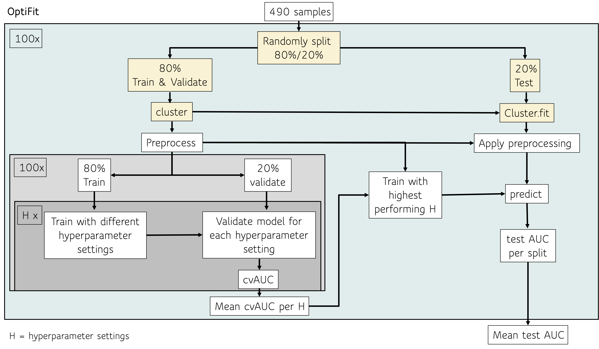
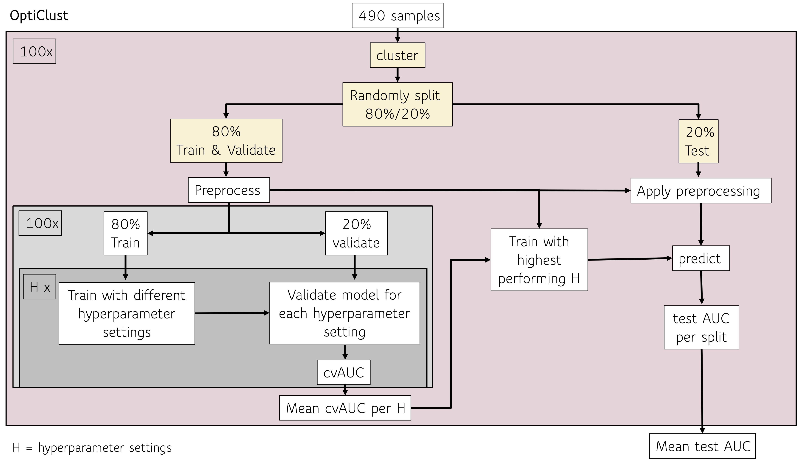
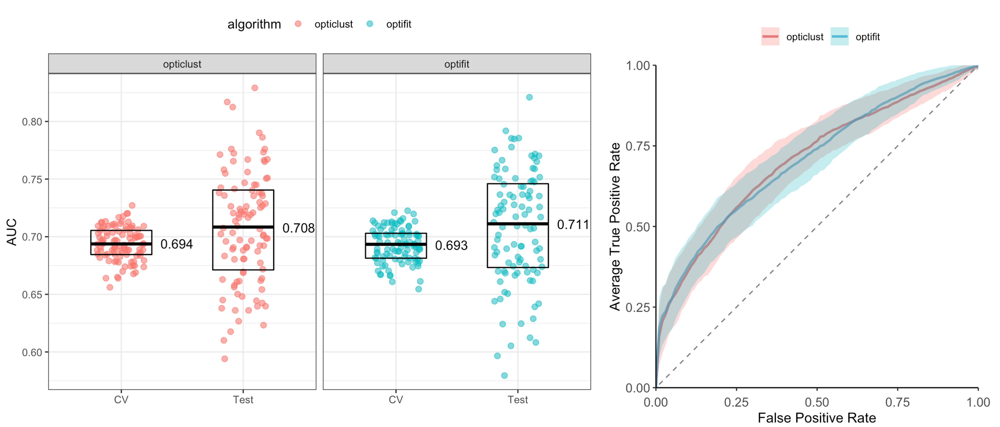

```{r knitr_settings, eval=TRUE, echo=FALSE, cache=FALSE, include=FALSE}
library(tidyverse)
library(knitr)
opts_chunk$set("tidy" = TRUE)
opts_chunk$set("echo" = FALSE)
opts_chunk$set("eval" = TRUE)
opts_chunk$set("warning" = FALSE)
opts_chunk$set("cache" = FALSE)

```

**Title Options:**  
Applying OptiFit: An Improved Method for Fitting Amplicon Sequences to Existing OTUs to Predict Colorectal Cancer  
Predicting colorectal cancer with an improved method for fitting amplicon sequences to existing OTUs  
Efficient microbiome-based machine learning prediction of colorectal cancer using OptiFit  
OptiFit streamlines microbiome-based machine learning prediction of colorectal cancer  
OptiFit enables integration of new amplicon sequence data to existing OTUs for prediction of colorectal cancer

\vspace{10mm}

Running title: INSERT RUNNING TITLE HERE

\vspace{10mm}


Courtney R. Armour${^1}$, William L. Close$^{1,*}$, Begüm D. Topçuoğlu$^{1,\#}$, Patrick D. Schloss $^{1,\dagger}$

\vspace{5mm}

${^1}$ Department of Microbiology and Immunology, University of Michigan, Ann Arbor MI.

${^*}$ Current Affiliation:

${^\#}$ Current Affiliation: Bristol Myers Squibb, Summit, New Jersey, USA   

$\dagger$ To whom correspondence should be addressed: pschloss@umich.edu  

\vspace{10mm}

**observation format** (max 1200 words, 2 figures, 25 ref)

\newpage

\linenumbers


## Abstract (250 word max)

## Importance (150 word max)


\newpage

Gut microbiome community composition is useful as a resource for machine learning prediction of various diseases {}. Amplicon sequencing of the 16S rRNA gene is a reliable tool for assessing the taxonomic composition of microbial communities. Analysis of 16S rRNA sequence data generally relies on clustering of sequences based on similarity into operational taxonomic units (OTUs). However, OTU clustering depends on the data in the dataset and the addition of new data could change the overall OTU clusters. The unstable nature of OTU clustering complicates deployment of machine learning models since integration of additional data requires re-clustering all the data and re-training of the model. The ability to integrate new data into an existing model without re-clustering and re-training could allow for deployment of a single model that new data can be continually added to and predicted on. Recently Sovacool *et al* described a new method for fitting new data into existing OTU clusters {Kelly optifit 2022}. While OptiFit works well to fit new sequence data and provide high quality OTU clusters, it is unknown if the use of OptiFit will have an impact on machine learning predictions. Here, we use OptiFit with a 16S rRNA sequence dataset consisting of normal and SRN samples to test how well new data integrated with OptiFit performs for prediction of SRN.  

To assess machine learning prediction performance using OptiFit, we downloaded a publicly available dataset of 16S rRNA amplicon sequences from stool samples. The data set includes samples from healthy subjects as well as subjects with screen-relevant neoplasia (SRN) consisting of advanced adenoma and carcinoma. To simulate a scenario where we build a model with a set of data and then add additional data, we randomly split the dataset where 80% of the data was clustered into OTUs and the remaining 20% was used integrated into the existing OTUs with the OptiFit algorithm (Figure 1A). To account for variation depending on the split of the data, the data was randomly split 100 times and the process repeated for each of the 100 data splits. For comparison, the standard process using OptiClust was conducted where all of the data was clustered into OTUs using the OptiClust algorithm and the resulting OTU abundance table was split into the testing and training set (Figure 1B).  

```{r mcc,include=F}
merged_mcc <- read_csv("../data/learning/summary/merged_MCC.csv")

opticlust_mcc <- merged_mcc %>% 
  filter(algorithm == "opticlust") %>% 
  pull(mcc)

optifit_avg_mcc <- merged_mcc %>% 
  filter(algorithm == "optifit" & state=="combo") %>% 
  summarise(mean_mcc = mean(mcc))
```
One way to examine the quality of the OTU clusters is with the Matthews correlation coefficient (MCC) which looks at the similarity between all pairs of sequences and assess whether they are appropriately in the same OTU or not {Westcott 2017 mSphere OptiClust}. An MCC score of zero indicates low quality OTU clusters while a score of 1 indicates high quality OTU clusters. Since the data is only clustered once in the OptiClust pathway there is only one MCC score while the OptiFit method produces an MCC score for the OTU clusters from each data split. Overall the MCC scores were similar between OptiClust (MCC = `r round(opticlust_mcc,digits=3)`) and OptiFit (average MCC = `r round(optifit_avg_mcc,digits=3)`) indicating that OptiFit does a good job of appropriately integrating new sequences into the existing OTUs.  

A potential problem to using OptiFit for machine learning prediction is that any sequences in the new data that do not map to the existing OTU clusters will be discarded resulting in a possible loss of information. To quantify whether this impacts model performance we used the taxonomic abundances of the training data from the OptiClust and OptiFit pathways to train a model to predict SRNs based on OTU abundances. This model was then deployed to predict the diagnosis classification of the held out test data. To compare model performance we calculated the area under the receiver operating characteristic curve (AUROC) for each data split on both the training data and the testing data. The model performance during training was equivalent between the two algorithms (OptiClust median CV AUC 0.694, OptiFit median CV AUC 0.693, Figure 2A). Additionally, the performance on the test data was equivalent between the two algorithms (OptiClust median CV AUC 0.694, OptiFit median CV AUC 0.693, Figure 2A,B) indicating that new data can be integrated into existing OTU clusters without impacting model performance.

Overall this analysis demonstrated that OptiFit can be used to fit new sequence data into existing OTU clusters and perform equally in predicting SRNs compared to clustering all of the sequence data together. The ability to integrate new data into existing OTUs enables the deployment of a single machine learning model based on microbiome composition that new data can be predicted on. These results are based on a single dataset and disease. Further analysis is needed to determine if the process works well for data collected or processed with different methodology or prediction of other conditions. 

## Materials and Methods
***Data Set.*** Raw 16S rRNA amplicon sequence data isolated from human stool samples was downloaded from NCBI Sequence Read Archive (accession no. SRP062005) {baxter}. This data set contains stool samples from a total of N subjects, however after preprocessing to screen for sequence quality and subsample to 10,000 reads per sample, 490 samples remained. For this analysis, samples from subjects identified in the metadata as normal, high risk normal, or adenoma were categorized as "normal" while samples from subjects identified as advanced adenoma or carcinoma were categorized as "screen relevant neoplasia" (SRN). The resulting data set consisted of 261 normal samples and 229 SRN samples. 

***Data Processing.*** The full dataset was pre-processed with mothur (v1.45) using the SILVA reference database (v132) {silva} to join forward and reverse reads, merge duplicate reads, align to the reference, pre-cluster, remove chimeras, assign taxonomy, and remove non-bacterial reads following the Schloss Lab MiSeq standard operating procedure described on the mothur website (https://mothur.org/wiki/miseq_sop/). 100 splits of the 490 samples were generated where 80% of the samples (392 samples) were randomly assigned to the training set and the remaining 20% (98 samples) were assigned to the test set. Using 100 splits of the data accounts for the variation that may be observed depending on the samples that are in the training or test sets. Each samples was in the training set an average of N times and the test set and average of N times. 

The data was processed through two pathways. First, the standard pathway using the OptiClust algorithm. In this pathway, all of the data was clustered together to generate OTUs and the resulting abundance tables were split into the training and testing sets. In the second pathway, the pre-processed data was split into the training and testing sets. The training set was clustered into OTUs, then the test set was fit to the OTUs of the training set using the OptiFit algorithm. The OptiFit algorithm was run with method open so that any sequences that didn't map to the existing OTU clusters would form new OTUs. Any OTUs that were not in the training set were removed prior to machine learning. For both pathways all data was sub-sampled to 10,000 reads per sample.

***Machine Learning.*** Machine learning using Random Forest was conducted with the R package mikrompl (v XXXX) {} to predict the diagnosis (SRN or normal) for the samples in the test set for each data split. The training set was preprocessed to normalize values (scale/center), collapse colinear features, and remove features with zero-variance. The preprocessing from the training set was then applied to the test set. P values comparing model performance were calculated as previously described {}. The averaged ROC curves were plotted by taking the average and standard deviation of the sensitivity at each specificity value.

***Code Availability.*** all code used in this analysis is available at https://github.com/SchlossLab/Armour_OptiFitGLNE_XXXX_2021

## Acknowledgements
(funding)

\newpage

## Figures  


  

**Figure 1. Workflow** description. 



**Figure 2. Model Performance.** **A)** Mean AUC **B)** Averaged ROC curves


\newpage

## References
