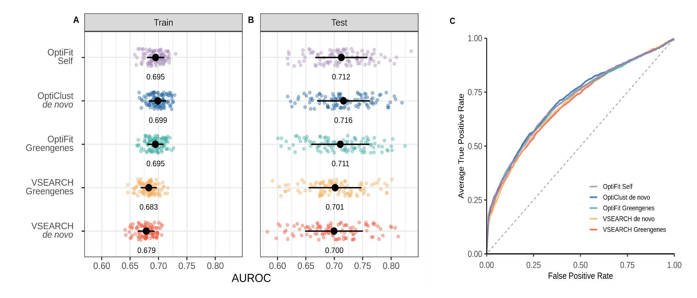

```{r settings, eval=TRUE, echo=FALSE, cache=FALSE, include=FALSE}
library(tidyverse)
library(knitr)
opts_chunk$set("tidy" = TRUE)
opts_chunk$set("echo" = FALSE)
opts_chunk$set("eval" = TRUE)
opts_chunk$set("warning" = FALSE)
opts_chunk$set("cache" = FALSE)


format_decimal <- function(number,digits){
  return(round(number,digits=digits))
}

```

\vspace{5mm}

Running title: Reference-based OTU clustering for ML classification

\vspace{10mm}

Courtney R. Armour${^1}$, Kelly L. Sovacool${^2}$, William L.
Close$^{1,*}$, Begüm D. Topçuoğlu$^{1,\#}$, Jenna Wiens${^3}$, Patrick
D. Schloss $^{1,\dagger}$

\vspace{10mm}

${^1}$ Department of Microbiology and Immunology, University of
Michigan, Ann Arbor, Michigan, USA

${^2}$ Department of Computational Medicine and Bioinformatics,
University of Michigan, Ann Arbor, Michigan, USA

${^3}$ Department of Electrical Engineering and Computer Science,
University of Michigan, Ann Arbor, Michigan, USA

${^*}$ Current Affiliation: Bio-Rad Laboratories, Hercules, California,
USA

${^\#}$ Current Affiliation: Bristol Myers Squibb, Summit, New Jersey,
USA

$\dagger$ To whom correspondence should be addressed:
[pschloss\@umich.edu](mailto:pschloss@umich.edu)

\vspace{10mm}

**observation format** (max 1200 words, 2 figures, 25 ref)

\newpage

\linenumbers

## Abstract

Machine learning classification of disease using the gut microbiome
often relies on clustering 16S rRNA gene sequences into operational
taxonomic units (OTUs) to quantify microbial composition. The abundance
of each OTU is then used to train a classification model. The standard
de novo approach to clustering sequences into OTUs leverages the
similarity of the sequences to each other rather than to a reference
database. However, such an approach depends on the sequences in the
dataset and therefore OTU assignments can change if new data are added.
This lack of stability complicates classification because in order to
use the model to classify additional samples, the new sequences must be
reclustered with the old data and the model must be retrained with the
new OTU assignments. The new reference-based clustering algorithm,
OptiFit, addresses this issue by fitting new sequences into existing
OTUs. While OptiFit can produce high quality OTU clusters, it is unclear
whether this method for fitting new sequence data into existing OTUs
will impact the performance of classification models. We used OptiFit to
cluster additional data into existing OTU clusters and then evaluated
model performance in classifying a dataset containing samples from
patients with and without colonic screen relevant neoplasia (SRN). We
compared the performance of this model to the standard procedure of de
novo clustering all the data together. We found that both approaches
performed equally well in classifying SRNs. OptiFit can streamline the
process of classifying new samples by avoiding the need to retrain
models using reclustered sequences.

## Importance

There is great potential for using microbiome data to non-invasively
diagnose people. One of the challenges with using classification models
based on the relative abundance of operational taxonomic units (OTUs) is
that 16S rRNA gene sequences are assigned to OTUs based on their
similarity to other sequences in a dataset. If data are generated from
new patients seeking a diagnosis, then a standard approach requires
reassigning sequences to OTUs and retraining the classification model.
Yet there is a desire to have a single, validated model that can be
widely deployed. To overcome this obstacle, we applied the OptiFit
clustering algorithm which fits new sequence data to existing OTUs and
allows for the reuse of models. A random forest machine learning model
implemented using OptiFit performed as well as the traditional
reassignment and retrain approach. This result indicates that there is
potential for developing and applying machine learning models based on
OTU relative abundance data that do not require retraining.

\newpage

Gut community composition is useful as a resource for machine learning
classification of diseases, such as colorectal cancer [@baxter2016;
@zackular2014]. Taxonomic composition of microbial communities can be
assessed using amplicon sequencing of the 16S rRNA gene, which is the
input to classification models. Analysis of 16S rRNA gene sequence data
generally relies on similarity-based clustering of sequences into
operational taxonomic units (OTUs). The process of OTU clustering can
either be reference-based or *de novo*. The quality of OTUs generated
with reference-based clustering is generally poor compared to those
generated with *de novo* clustering @westcott2015. While *de novo*
clustering produces high-quality OTU clusters where sequences are
accurately grouped based on similarity thresholds, the resulting OTU
clusters depend on the sequences within the dataset and the addition of
new data has the potential to redefine OTU cluster composition. The
unstable nature of *de novo* OTU clustering complicates deployment of
machine learning models since integration of additional data requires
reclustering all the data and retraining the model. The ability to
integrate new data into a validated model without reclustering and
retraining could allow for the application of a single model that can
continually classify new data. Recently, Sovacool *et al.* introduced
OptiFit, a method for fitting new sequence data into existing OTUs
@sovacool2022. While OptiFit can effectively fit new sequence data to
existing OTU clusters, it is unknown if the use of OptiFit will have an
impact on classification performance. Here, we tested the ability of
OptiFit to cluster new sequence data into existing OTU clusters for the
purpose of classifying disease based on gut microbiome composition.

We compared two approaches, one using all the data to generate OTU
clusters, and the other generating *de novo* OTU clusters with a portion
of the data and then fitting the remaining sequence data to the existing
OTUs using OptiFit. In the first approach, all the 16S rRNA sequence
data was clustered into OTUs with the OptiClust algorithm in mothur
@westcott2017. The resulting abundance data was then split into training
and testing sets, where the training set was used to tune
hyperparameters and ultimately train and select the model. The model was
applied to the testing set and performance evaluated (Figure 1A).
However, this methodology requires one to regenerate the OTU clusters
and retrain the model to classify additional samples. The OptiFit
algorithm @sovacool2022 addresses this problem by enabling new sequences
to be clustered into existing OTUs. The OptiFit workflow is similar to
the OptiClust workflow, where the data was clustered into OTUs and used
to tune hyperparameters and ultimately train the model. Then, we used
OptiFit to fit sequence data of samples not part of the original dataset
into the existing OTUs, and used the same model to classify the samples
(Figure 1B). To test how the model performance compared between these
two approaches, we used a publicly available dataset of 16S rRNA gene
sequences from stool samples of healthy subjects (n = 261) as well as
subjects with SRN consisting of advanced adenoma and carcinoma (n = 229)
@baxter2016. The dataset was randomly split into an 80% train set and
20% test set. For the standard OptiClust workflow, the training and test
sets were *de novo* clustered together into OTUs, then the resulting
abundance table was split into the training and testing set. For the
OptiFit workflow, the train set was clustered *de novo* into OTUs, and
the remaining test set was fit to the OTU clusters using the OptiFit
algorithm. For both workflows, the abundance table of the train set was
used to tune hyperparameters and train a random forest model to classify
SRN. The test set was classified as either control or SRN using the
trained models. To account for variation, the dataset was randomly split
100 times and the process repeated for each of the 100 data splits. By
comparing the model performance of classifying the samples in the test
dataset between the OptiFit and OptiClust algorithms, we quantified the
impact of using OptiFit on model classification performance.

```{r mcc,include=F}
merged_mcc <- read_csv("../data/learning/summary/merged_MCC.csv")

opticlust_mcc <- merged_mcc %>% 
  filter(algorithm == "opticlust") %>% 
  pull(mcc)

optifit_avg_mcc <- merged_mcc %>% 
  filter(algorithm == "optifit" & state=="combo") %>% 
  summarise(mean_mcc = mean(mcc),
            sd_mcc = sd(mcc))
```

```{r frac_mapped,include=F}
avg_frac_mapped <- read_csv("../results/tables/fracNonMapped.csv",show_col_types = F) %>% 
  mutate(avg_frac = RefSum/10000) %>% 
  summarise(mean = mean(avg_frac),
            sd = sd(avg_frac))
```

We first examined the quality of the resulting OTU clusters from the two
algorithms using the Matthews correlation coefficient (MCC). The MCC
score was quantified by examining all pairs of sequences and assessing
whether they belonged together in an OTU based on their similarity
@westcott2017. MCC scores range between negative one and one. A score of
negative one means none of the sequences in an OTU are within the
similarity threshold and any sequences within the similarity threshold
are not in an OTU together. An MCC score of zero means the sequences are
randomly clustered. An MCC score of 1 means all sequences in an OTU are
within the similarity threshold and all sequence pairs within the
similarity threshold are in the same OTU. To ensure that OptiFit is
appropriately integrating new sequence data into the existing OTUs, we
expected the MCC scores produced by the OptiClust and OptiFit workflows
to be similar. Since the data was only clustered once in the OptiClust
workflow there was only one MCC score (MCC =
`r round(opticlust_mcc,digits=3)`) while the OptiFit workflow produced
an MCC score for the OTU clusters from each data split (average MCC =
`r round(optifit_avg_mcc %>% pull(mean_mcc),digits=3)`, standard
deviation = `r round(optifit_avg_mcc %>% pull(sd_mcc),digits=3)`). As
expected, the MCC scores were similar between the two workflows. Another
metric we examined for the OptiFit workflow was the fraction of
sequences from the test set that mapped to the reference OTUs. Any
sequences that did not map to reference OTUs were eliminated therefore,
if a high percentage of reads did not map we might expect this loss of
data to negatively impact classification performance. We found that loss
of data was not an issue since on average
`r format_decimal((avg_frac_mapped %>% pull(mean))*100,digits = 1)`%
(standard deviation =
`r format_decimal(avg_frac_mapped %>% pull(sd),digits = 3)`) of
sequences in the test set mapped to the reference OTUs. These results
indicate that OptiFit performed as well as OptiClust when integrating
new sequences into the existing OTUs.

```{r performance,include=F}
performance <- read_csv("../data/learning/summary/merged_performance.csv",
                    col_types = cols(algorithm=col_character(),
                                     method=col_character(),
                                     split=col_character(),
                                     .default=col_double())) 

performance_summary <- performance %>% 
  group_by(algorithm) %>% 
  summarise(median_cv_AUC = round(median(cv_metric_AUC),digits=3),
            mean_cv_AUC = round(mean(cv_metric_AUC),digits=3),
            sd_cv_AUC = round(sd(cv_metric_AUC),digits=3),
            median_AUC = round(median(AUC),digits=3),
            mean_AUC = round(mean(AUC),digits=3),
            sd_AUC = round(sd(AUC),digits=3))

pvals <- read_csv("../results/tables/pvalues.csv",col_types = cols(p_value = col_double(),
                                                                   .default = col_character())) %>% 
  select(metric,p_value)
```

After verifying that the quality of the OTUs was consistent between
OptiClust and OptiFit, we examined the model performance for classifying
samples in the held out test dataset. To evaluate model performance, we
used the OTU relative abundances from the training data from the
OptiClust and OptiFit workflows to train a model to predict SRNs. Using
the predicted and actual diagnosis classification, we calculated the
area under the receiver operating characteristic curve (AUROC) for each
data split to quantify model performance. During cross-validation (CV)
training, the model performance was equivalent between the OptiClust and
OptiFit approaches (p-value =
`r format_decimal(pvals %>% filter(metric == "cv_metric_AUC") %>% select(p_value),2)`;
Figure 2A). The trained model was then applied to the test data
classifying samples as either control or SRN. The performance on the
test data was equivalent between the OptiClust and OptiFit approaches
(p-value =
`r format_decimal(pvals %>% filter(metric == "AUC") %>% select(p_value),2)`;
Figures 2B and 2C) indicating that new data could be fit to existing OTU
clusters using OptiFit without impacting model performance.

We tested the ability of OptiFit to integrate new data into existing
OTUs for the purpose of machine learning classification using OTU
relative abundance. A potential problem with using OptiFit is that any
sequences from the new samples that do not map to the existing OTU
clusters will be discarded, resulting in a possible loss of information.
However, we demonstrated OptiFit can be used to fit new sequence data
into existing OTU clusters and performs equally well in predicting SRN
compared to *de novo* clustering all the sequence data together. The
ability to integrate data from new samples into existing OTUs enables
the implementation of a single machine learning model. This is important
for model implementation because not all of the data needs to be
available or known at the time of model generation. Since results may
depend on the amount of data in the training set, further analysis is
needed to determine the number of samples that are necessary in training
to build a robust model capable of classifying diverse samples. A robust
machine learning model could be implemented as part of a non-invasive
and low-cost aid in diagnosing SRN and other diseases.

## Materials and Methods

***Dataset.*** Raw 16S rRNA gene sequence data isolated from human stool
samples was downloaded from NCBI Sequence Read Archive (accession no.
SRP062005) [@edgar2011; @baxter2016]. This dataset contains stool
samples from a total of 490 subjects. For this analysis, samples from
subjects identified in the metadata as normal, high risk normal, or
adenoma were categorized as "normal", while samples from subjects
identified as advanced adenoma or carcinoma were categorized as "screen
relevant neoplasia" (SRN). The resulting dataset consisted of 261 normal
samples and 229 SRN samples.

```{r n_test_train,include=F}
n_test_train <- read_csv("../results/tables/splitTogetherFrequency.csv") %>% 
  mutate(n_test = rowSums(across(starts_with("split_")))) %>% 
  select(Group,n_test) %>% 
  mutate(n_train = 100 - n_test) %>% 
  summarize(avg_test = mean(n_test),
            sd_test = sd(n_test),
            avg_train = mean(n_train),
            sd_train = sd(n_train))
```

***Data Processing.*** The full dataset was preprocessed with mothur
(v1.47) @schloss2009 to join forward and reverse reads, merge duplicate
reads, align to the SILVA reference database (v132) @quast2013,
precluster, remove chimeras with UCHIME @edgar2011, assign taxonomy, and
remove non-bacterial reads following the Schloss Lab MiSeq standard
operating procedure described on the mothur website
(<https://mothur.org/wiki/miseq_sop/>). 100 splits of the 490 samples
were generated where 80% of the samples (392 samples) were randomly
assigned to the training set and the remaining 20% (98 samples) were
assigned to the test set. Using 100 splits of the data accounts for the
variation that may be observed depending on the samples that are in the
training or test sets. Each sample was in the training set an average of
`r n_test_train %>% pull(avg_train)` times (standard deviation =
`r format_decimal(n_test_train %>% pull(sd_train),digits = 1)`) and the
test set an average of `r n_test_train %>% pull(avg_test)` times
(standard deviation =
`r format_decimal(n_test_train %>% pull(sd_test),digits = 1)`).

The data was processed through two workflows. In the control workflow,
all the data was clustered together with OptiClust @westcott2017 to
generate OTUs and the resulting abundance tables were split into the
training and testing sets. In the experimental workflow, the
preprocessed data was split into the training and testing sets. The
training set was clustered into OTUs using OptiClust, then the test set
was fit to the OTUs of the training set using the OptiFit algorithm
@sovacool2022. The OptiFit algorithm was run with method open so that
any sequences that did not map to the existing OTU clusters would form
new OTUs. For both pathways, the shared files were sub-sampled to 10,000
reads per sample.

***Machine Learning.*** A random forest model was trained with the R
package mikrompl (v 1.2.0) @topçuoglu2021 to predict the diagnosis (SRN
or normal) for the samples in the test set for each data split. The
training set was preprocessed to normalize OTU counts (scale and
center), collapse correlated OTUs, and remove OTUs with zero variance.
The preprocessing from the training set was then applied to the test
set. Any OTUs in the test set that were not in the training set were
removed. P values comparing model performance were calculated as
previously described @topçuoglu2020. The averaged ROC curves were
plotted by taking the average and standard deviation of the sensitivity
at each specificity value.

***Code Availability.*** The analysis workflow was implemented in
Snakemake @koster2012 . Scripts for analysis were written in R @R2020
and GNU bash @GNUbash. The software used includes mothur v1.47.0
@schloss2009, RStudio @RStudio2019, the Tidyverse metapackage
@wickham2019, R Markdown @xie_r_2018, the SRA toolkit
@noauthor_sra-tools_nodate, and conda @noauthor_anaconda_2016. The
complete workflow and supporting files required to reproduce this study
are available at:
<https://github.com/SchlossLab/Armour_OptiFitGLNE_XXXX_2021>

## Acknowledgements

This work was supported through a grant from the NIH (R01CA215574).

\newpage

## References

```{=tex}
\setlength{\parindent}{-0.25in}
\setlength{\leftskip}{0.25in}
```
\noindent

::: {#refs}
:::

```{=tex}
\setlength{\parindent}{0in}
\setlength{\leftskip}{0in}
```
\newpage

## Figures


**Figure 1: Workflows.** **A)** OptiClust workflow: The full dataset was
clustered into OTUs using the OptiClust algorithm in mothur. The data
was then split into two sets where 80% of the samples were assigned to
the training set and 20% to the testing set. The training set was
preprocessed with mikropml to normalize values (scale and center),
collapse correlated features, and remove features with zero variance.
Using mikropml, the training set was split into train and validate sets
to compare results using different hyperparameter settings. The highest
performing hyperparameter setting was then used to train the model with
the full training set. The preprocessing scale from the training set was
applied to the test dataset, then the trained model was used to classify
the samples in the test set. Based on the actual classification and
predicted classification, the area under the receiver operating
characteristic curve (AUROC) was calculated to summarize model
performance. The entire process was repeated 100 times to account for
variability depending on the split of the data resulting in a total of
100 AUROC values summarizing the performance of the standard OptiClust
workflow. **B)** OptiFit workflow: The dataset was first split into two
sets where 80% of the samples were assigned to the training set and 20%
to the testing set. The training set was then clustered into OTUs using
the OptiClust algorithm in mothur. The resulting abundance data was
preprocessed with mikropml to normalize values (scale/center), collapse
correlated features, and remove features with zero-variance. Using
mikropml, the training set was split into train and validate sets to
compare results using different hyperparameter settings. The highest
performing hyperparameter setting was then used to train the model with
the full training set. The OptiFit algorithm in mothur was used to
cluster the held out testing dataset using the OTUs of the training set
as a reference. The preprocessing scale from the training set was
applied to the test dataset, then the trained model was used to classify
the samples in the test set. Based on the actual classification and
predicted classification, the area under the receiver operating
characteristic curve (AUROC) was calculated to summarize model
performance. The entire process was repeated 100 times to account for
variability depending on the split of the data resulting in a total of
100 AUROC values summarizing the performance of the new OptiFit
workflow.

\newpage



**Figure 2: Model Performance.** **A)** Area under the receiver
operating characteristic (AUROC) curve during cross-validation for the
OptiClust and OptiFit workflows. Mean and standard deviation of the
AUROC is represented by the black dot and whiskers. Mean AUROC is
printed to the right of the points. **B)** AUROC on the test data for
the OptiClust and OptiFit workflows. Mean and standard deviation of the
AUROC is represented by the black dot and whiskers. The mean AUROC is
printed to the right of the points. **C)** Averaged receiver operating
characteristic (ROC) curves.
